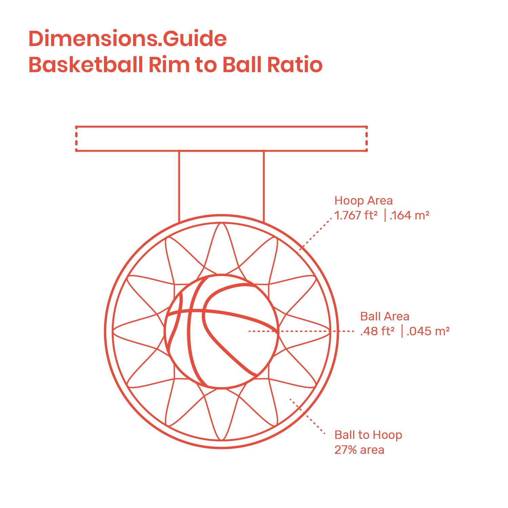

# Shooting Basketball With Deep Learning

Using tensorflow we will predict the throw velocity and scores a lot


## Tools
I will be using Pandas, Numpy and Tensorflow for the data analysis. For the GUI visualisations, I will use pygame

## <ins>The Ball and the Basket</ins>
### The Ball - Projectile Motion
First let's dive into the physics of projectile motion.

for a given initial launch angle,
$\theta$  
the horizontal and vertical components of the velocity are:

$v_{0x} = v_{0}\cos(\theta)$  

$v_{0y} = v_{0}\sin(\theta)$  

and the components of velocity at any time $t$ are:

$v_{tx} = v_{0}\cos(\theta)$  

$v_{ty} = v_{0}\sin(\theta) - gt$  


For a given change in time dt the new poistion of the ball will be:

```python

 def updateVx(self, dt):
     self.vx = self.vx + self.ax * dt
     return self.vx

 def updateVy(self, dt):
     self.vy = self.vy + self.ay * dt
     return self.vy

 def updateX(self, dt):
     self.x = int(self.x + 0.5*(self.vx + self.updateVx(dt))*dt)
     return self.x

 def updateY(self, dt):
     self.prev_y = self.y
     self.y = int(self.y - 0.5*(self.vy + self.updateVy(dt))*dt)
     return self.y
```

Adding a GUI we can test the ball motion:


# The Basket
After an online research I came across the following ratio:



After some styles and text keep track of the score we get:


We are ready to predict some shots!

## <ins>Data and Prediction</ins>

### 1. Generate Data

I let the computer to play with random vectors of :
position(x,y), V and angle.

After some time I gathered the Data and saved the throws which got into the basket for the learning process.

### 2. Modal Prediction

#### 1. Create Xs:
I changed the position - (x,y) to polar coordinates where the axes origin is the center of the hoop hence:

$r = \sqrt{x^{2} + y^{2}}$

$\phi = \operatorname{atan2}(y, x)$

#### 2. Split to train-test:
I used 70% of the data to train the modal and evaluated the prediction with throws from the test samples. (the remain 30%)

#### 3. The NN:
I used tensorflow with 4 hidden layers and activation of relu.
the epochs set to 3000 and batch size of 200.

#### 4. Evaluation
It’s game day!

After to modal trained, I ran the game script with the modal outputs and was glad to see that 98% of the throws was getting in the basket!!

I highly recommend you check [source code on Github](https://github.com/shayme92/DL_Basketball_throws)
 and prompt any question)
